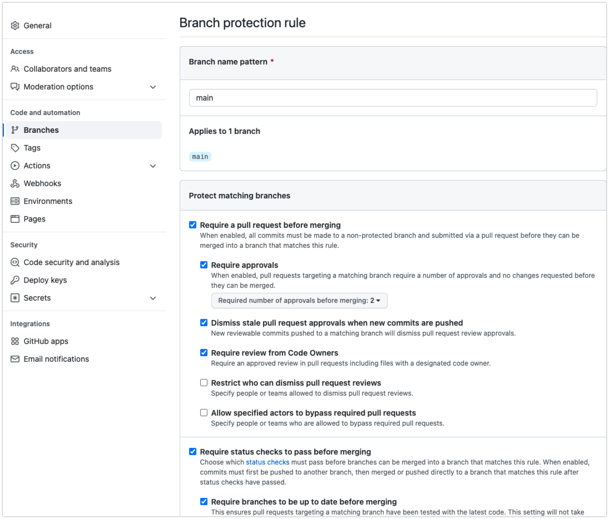

| Languages       | Products        |   Tools       |    Description                        |
| :---            |    :----        |      :---     |       :---                            |
| Java, Spring boot, Azure Fucntions         | GitHub, Azure   |    Maven,  Ngrok, Azure CLI        |This is a sample application to showcase how to automatically enable branch protection when every new repository created under GitHub Organization

## GitHub Repository Branch Auto Protection

This is a sample application to showcase how to automatically enable branch protection when every new repository created in a [GitHub Organization](https://docs.github.com/en/organizations/collaborating-with-groups-in-organizations/about-organizations).

This application is using GitHib organization [webhooks](https://docs.github.com/en/rest/reference/orgs#webhooks) to send an HTTP POST payload to a third-party service that uses the GitHub [REST API](https://docs.github.com/en/rest) to programmatically enable protection on the default branch of the newly created repository.

The third-party service is implemented using Java Spring Boot as a serverless [Azure Cloud function](https://azure.microsoft.com/en-us/services/functions/#overview).

:bulb: **Tip:** You can use [ngrok](https://ngrok.com/) or similar solutions to expose the service directly from an http server running in localhost.

:bulb: This project uses the [GitHub API For Java](https://github-api.kohsuke.org/) library to manage GitHub resources.

:memo: **Note:** The third-party service can be implemented in any programming language and deployed to any platform as long it is able to receive events sent by the Organization webhook. GitHub provides the [Octokit library](https://docs.github.com/en/rest/overview/libraries) in Ruby, .Net and Javascript. [Third-party libraries](https://docs.github.com/en/rest/overview/libraries#third-party-libraries) are also available to support other languages.

### How It Works

This block diagram shows how the Webhook configured at an organization level sends create repository events to an Azure Serverless fucntion. And Azure Serverless fucntion can enable the protection on default branch on the created repository.


This sequence diagrams depicts how the sequence steps needed to enable auto protection on the default branch when a new repository is created.


### Getting Started

These instructions will guide you on building and deploying the Azure Cloud Function and configuring the GitHub organization webhook.

#### Prerequisites

- [GitHub](https://docs.github.com/en/get-started/signing-up-for-github/signing-up-for-a-new-github-account) personal account
- [Java Developer Kit](https://docs.microsoft.com/en-us/azure/developer/java/fundamentals/java-support-on-azure), version 11
- [Apache Maven, version 3.0 or above](https://maven.apache.org/) - For building and running locally
- [Azure Free Account](https://azure.microsoft.com/free/?ref=microsoft.com&utm_source=microsoft.com&utm_medium=docs&utm_campaign=visualstudio) account
- [Azure Functions Core Tools](https://docs.microsoft.com/en-us/azure/azure-functions/functions-run-local#v2)  version 3.0.13901.0 or above

#### GitHub Personal Access Token

GitHub personal access token is needed to enable communication between the Azure cloud function and the GitHub API

Please follow the [documentation](https://docs.github.com/en/authentication/keeping-your-account-and-data-secure/creating-a-personal-access-token) to create a GitHub personal access token.

:warning: Save the personal access token in a safe place, it will be used later in this guide.

In this example scope is provided at workflow level


See GitHub's documentation to learn more about [scopes](https://docs.github.com/en/developers/apps/building-oauth-apps/scopes-for-oauth-apps#available-scopes).

#### Installation

Install below software if it's not pre-installed on your local computer.
[Install the Maven](https://maven.apache.org/install.html)
[Install the JDK](https://docs.oracle.com/en/java/javase/11/install/overview-jdk-installation.html#GUID-8677A77F-231A-40F7-98B9-1FD0B48C346A)
[Install the Azure CLI](https://docs.microsoft.com/en-us/cli/azure/install-azure-cli)
[Install the Azure Functions Core Tools](https://docs.microsoft.com/en-us/azure/azure-functions/functions-run-local?tabs=v4%2Cmacos%2Ccsharp%2Cportal%2Cbash)
[Install ngrok agent](https://ngrok.com/download) (Optional), To expose local server ports to the Internet.

- Clone the project: ``` bash git clone https://github.com/org-apex/github-repo-auto-protect.git ```

- Configure the project to use your own resource group and your own application name (**it should be unique across Azure**)
  - Open the pom.xml file and customize the resourceGroup and appName properties
  - This project uses the Maven Wrapper, so all you need is Java installed.

Build the project: ``` bash ./mvnw clean install -DskipTests=true ```

#### Setup
###### Azure Functions

Once the application is built succesfully, you can run it locally using the Azure Function Maven plug-in:

``` bash ./mvnw azure-functions:run ```

Spring boot azure fucntion webservice will start run succesfully on your local computer. In this example it's running on port 7071. You will see maven logs like:


###### Deploying to Azure Functions App

Deploy the application on Azure Functions with the Azure Function Maven plug-in:
:memo: **Note:**, make sure Application running locallys has been stopped.

``` bash ./mvnw azure-functions:deploy ```

- After a few seconds,  will create the resources in your Azure account. This may take some time.
- Once the process is finished a summary of the changes will be displayed on your terminal, make note of the API Gateway endpoint URL, it will be used to configure the GitHub Organization webhook.


- To validate that the deployment was successful, open your browser and navigate to the Azure portal  and go to Fucntion App > Functions


###### Github webhook setup

Once the third party application has been deployed, we are ready to configure our GitHub organization webhooks to notify the application when a new repository has been created.

- Open your browser and go to [GitHub](https://github.com)
- If you have not created a GitHub Organization yet, [create one](https://docs.github.com/en/organizations/collaborating-with-groups-in-organizations/creating-a-new-organization-from-scratch)
- Go to your GitHub organization settings page and select Webhooks.
- Setup the Azure serverless function service url <https://apex-githubpoc-function.azurewebsites.net/api/handler> to Github organization Webhooks.
- Select **application/json** in the **Content type** field.
- Enable SSL verification.
- Select individual events to trigger the webhook.
  - Uncheck the **Pushes** option.
  - Check the **Repositories** option.
- Check the **Active** option.
- Click the **Add webhook** button.


###### Local setup

(Optional) You can expose the local running service to internet:

- You can run [ngrok](https://ngrok.com/docs/getting-started) agent on your local computer

  ``` ngrok http 7071 ```

:bulb: If application is not running locally, run it locally using the Azure Function Maven plug-in:

``` bash ./mvnw azure-functions:run ```

After ngrok successful start, you will service exposed to internet as:


- Setup the ngrok URL for Azure serverless function service <https://b949-24-28-109-133.ngrok.io/api/handler> to Github organization Webhooks.
:bulb: For updating the webhook in Github, follow the steps under the section **Github webhook setup**

### Testing

Once the GitHub Organization webhook is configured to deliver events to the Azure Serverless function we can go ahead and test the use case.

- Login to [GitHub](https://github.com) and go to your Organization page
- Create a new repository
 
- Type a name in the **Repository** name field
- Make your repository **Public**
- Click on the **Create repository** button
 
- After a few seconds reload your repository page and you should see the following:
  - A new commit in your repository 
  - A new README.md, CONTRIBUTING.md, and LICESNSE.md files are created in the root of your repository.
  - A new issue created in your repository

	
	
- Go to your new repository settings, then select **branches** from the left and you should see that branch protection rules were added to your default branch



### Contributing

Please feel free to raise issues or submit pull requests to improve this project.

### Authors

- **Ravi Thallam** - *Initial work*

See also the list of [contributors](https://github.com/org-acme/repo-manager/contributors) who participated in this project.

### License

See the [LICENSE.md](LICENSE.md) file for details

### References / Acknowledgments

- [Spring Cloud Function in Azure](https://docs.microsoft.com/en-us/azure/developer/java/spring-framework/getting-started-with-spring-cloud-function-in-azure)
- [GitHub API for Java](https://github-api.kohsuke.org/)
- [README](https://gist.github.com/PurpleBooth/109311bb0361f32d87a2)
- [Thymeleaf Template](https://www.thymeleaf.org/doc/tutorials/3.0/usingthymeleaf.html)